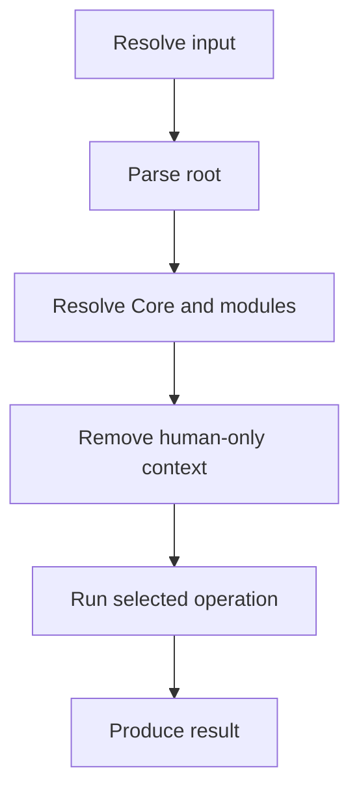

# specmd Tool Specification

## Specification Contract

This document defines the required behavior of `specmd`, a tool for authoring, validating, inspecting, rendering, testing, and adapting SPEC.md documents.

Uppercase **MUST**, **MUST NOT**, **SHOULD**, **SHOULD NOT**, and **MAY** use BCP 14 semantics.

Normative requirements define conformance. Examples, notes, rationale, history, and implementation guidance are informative unless explicitly marked normative.

This SPEC.md is authoritative for required behavior when implementation code or implementation documentation conflicts with it.

A conforming implementation MAY use different languages, frameworks, libraries, architectures, source organizations, or visual designs unless explicitly constrained.

If an unspecified implementation choice cannot materially alter conformance, the implementer MAY choose an appropriate solution. If an omission or ambiguity could materially affect observable behavior, data semantics, security, privacy, accessibility, interoperability, safety, or another normative property, it MUST be surfaced rather than silently resolved.

If two normative statements conflict, the conflict MUST be surfaced. Unresolved product or design decisions MUST be marked `TBD` or Open Issue, not guessed.

## 1. Overview and Scope

### 1.1 Purpose

`specmd` helps humans and LLMs work with SPEC.md documents without making the documents dependent on the tool.

The tool supports the lifecycle of a portable specification:

1. create the smallest useful starting document;
2. validate structural and normative conformance;
3. inspect quality, completeness, ambiguity, and portability;
4. render the specification for human review;
5. evaluate verification coverage and export acceptance material; and
6. create and maintain traceability artifacts; and
7. generate thin instructions for compatible external tools; and
8. optionally coordinate independent reviews by additional AI agents for broader semantic coverage; and
9. connect explicitly to external acceptance-test runtimes through isolated, optional integrations.

### 1.2 Actors

- **Author** — creates or changes a SPEC.md.
- **Reviewer** — evaluates a SPEC.md and its reports or rendered forms.
- **Implementer** — uses a SPEC.md to create a conforming implementation.
- **External Tool** — an LLM, coding agent, editor, CI system, or other consumer integrated through an adapter.

### 1.3 In Scope

- a command-line interface named `specmd`;
- operation on a single-file SPEC.md or a modular specification set;
- paired validation of a Root Specification and `TRACE.md`;
- the required commands `init`, `validate`, `inspect`, `blackbox`, `render`, `test`, `trace`, `adapt`, `standards`, `help`, and `capabilities`;
- the optional, separately invoked `cucumber` integration family;
- human-readable and machine-readable results;
- local and continuous-integration use;
- safe handling of human-only comments;
- optional multi-agent review through configured external-agent connectors; and
- thin adapters that preserve SPEC.md as the authoritative artifact.

### 1.4 Out of Scope

- prescribing a software-development methodology;
- managing requirements, design, implementation, or deployment phases;
- executing implementation tasks autonomously;
- project-management state, approval workflows, sprint planning, or issue tracking;
- replacing SPEC.md Core or defining a competing specification format;
- requiring a hosted service, account, IDE, LLM, or network connection;
- requiring Cucumber or another implementation-test runtime for ordinary `specmd` operation;
- imposing the Core's compactness target on design specifications.

### 1.5 Normative Specification Modules

The following documents form part of this Specification Set and are required for conformance:

- [Coding-Agent and Cognitive Integration Contract](SPECMD_AGENT_INTEGRATIONS.md)
- [CLI Interface Control Document](SPECMD_CLI_ICD.md)
- [Cucumber Connector Contract](SPECMD_CUCUMBER_CONNECTOR.md)
- [Help and Standards Sources Contract](SPECMD_HELP_AND_SOURCES.md)

The Root Specification owns global scope, terminology, invariants, precedence, and Specification Set version. A module may refine its declared area but MUST NOT contradict this Root Specification.

## 2. Context and Definitions

**SPEC.md Core** — the versioned standard identified by the root document's `specmd` value.

**Root Specification** — the canonical entry-point document for a Specification Set. Its filename is not constrained; `SPEC.md` is a convention and default only.

**Normative Module** — a document directly or transitively identified by the Root Specification as required for conformance.

**Specification Set** — the Root Specification and all its Normative Modules.

**Finding** — a diagnostic with a severity, stable rule identifier, message, and source location when available.

**Black-Box Contract** — the externally observable operations, inputs, outputs, errors, state effects, and constraints described by a Specification Set without reliance on implementation internals.

**Error** — a finding that prevents the input from conforming or the requested operation from completing reliably.

**Warning** — a likely quality, ambiguity, portability, or maintainability problem that does not by itself establish non-conformance.

**Information** — a neutral observation or measurement.

**Adapter** — generated instructions or configuration that help an External Tool consume SPEC.md without changing its normative meaning.

**Human-only comment** — content delimited by `SPECMD-HUMAN-ONLY` and `SPECMD-END-HUMAN-ONLY` as defined by SPEC.md Core.

**Core compactness target** — the project constraint that SPEC.md Core SHOULD remain below 2,500 tokens and 250 lines. It does not limit a Root Specification, Normative Module, or Specification Set.

**Creation Profile** — the standards profile selected when creating or evaluating a specification. `core` means Core-only. `optional` means Core plus the declared version and selected features of SPEC.md Optional; Optional is never used without Core.

**Trace Document** — an informative `TRACE.md` that maps specification identifiers to design, implementation, and verification evidence without redefining the specification.

**Trace Pair** — a Root Specification and one Trace Document evaluated together for version alignment, reference integrity, and trace coverage.

Paths displayed or serialized by the tool MUST use an unambiguous representation. Text input and output MUST support UTF-8.

### 2.1 Optional Conventions Used

This specification uses the following conventions from SPEC.md Optional 0.4.2 because they improve interoperability or verification:

- categorized requirements and stable semantic identifiers;
- requirement verification metadata;
- logical behavioral flows;
- advanced Specification Set organization;
- explicit external-operation boundaries;
- privacy, security, reliability, and compatibility requirements;
- composed-behavior verification;
- structured Given / When / Then acceptance notes;
- human-only comment processing; and
- an Open Issues register.

## 3. System Model

### 3.1 Logical Components

The tool consists logically of:

- an input resolver;
- a SPEC.md parser;
- a Specification Set resolver;
- a rule engine;
- a reporting layer;
- renderers; and
- adapter generators.

These are behavioral roles and do not require separate implementation components.

### 3.2 Processing Model

For every command that reads a specification, the tool MUST:

1. resolve the requested Root Specification;
2. read it without changing it;
3. identify the declared Core version;
4. resolve required Normative Modules when the operation applies to the full Specification Set;
5. exclude human-only comments from any LLM-facing or implementation-facing output;
6. perform the requested operation; and
7. report findings without silently changing normative content.

**Informative flow:**



### 3.3 Behavioral Flows

#### FLW-001 — Analyze a Specification Set

1. The Actor selects a Root Specification and an analytical command.
2. The tool resolves the declared Core and every declared Normative Module.
3. The tool performs deterministic checks.
4. The tool performs explicitly enabled heuristic checks, if any.
5. The tool returns an overall result and findings that distinguish deterministic and heuristic evidence.

#### FLW-002 — Generate a Derived Artifact

1. The Actor selects `render`, `test` export, or `adapt` and an output target.
2. The tool resolves and validates the required source material.
3. The tool removes human-only comments from implementation-facing context.
4. The tool prepares the derived artifact without modifying normative source content.
5. If the destination exists, the tool requires explicit replacement authorization.
6. The tool writes the artifact and identifies the source `spec_version`.

### 3.4 Invariants

- **INV-001:** A SPEC.md remains usable as plain Markdown without `specmd`.
- **INV-002:** No command MUST change normative meaning unless the user explicitly requests a write operation that necessarily does so.
- **INV-003:** Validation and inspection MUST NOT treat document length above 250 lines or 2,500 tokens as a defect.
- **INV-004:** The Core compactness target applies only when the analyzed artifact identifies itself as SPEC.md Core.
- **INV-005:** An adapter MUST point to SPEC.md as authoritative and MUST NOT create an independent competing source of product behavior.
- **INV-006:** Human-only comments MUST NOT influence implementation, conformance, acceptance output, or adapter instructions.
- **INV-007:** A missing, unreadable, cyclic, or contradictory Normative Module MUST be surfaced.
- **INV-008:** The tool MUST NOT execute code embedded in or referenced by a specification merely to parse, validate, inspect, render, test, perform black-box analysis, or adapt it.

## 4. Requirements

### 4.1 Common Command Behavior

- **CLI-001:** The executable command MUST be `specmd`.
- **CLI-002:** Every command MUST accept an explicit input path.
- **CLI-003:** When no input path is supplied, commands that read a specification SHOULD use `SPEC.md` in the current working directory.
- **CLI-004:** Every analytical command MUST support human-readable output.
- **CLI-005:** `validate`, `inspect`, `blackbox`, `test`, and `trace` MUST support machine-readable JSON output.
- **CLI-006:** Machine-readable findings MUST include `rule_id`, `severity`, `message`, and, when identifiable, file and location.
- **CLI-007:** The tool MUST use stable, documented process exit statuses suitable for continuous integration.
- **CLI-008:** Equivalent input and configuration SHOULD produce semantically equivalent results independent of operating system.
- **CLI-009:** Commands MUST operate without network access when the required Core document, Root Specification, modules, templates, and adapters are locally available.
- **CLI-010:** A command MUST NOT overwrite an existing file unless the user explicitly authorizes replacement.
- **CLI-011:** Commands that create or evaluate standards-profile behavior MUST accept the profile values `core`, `optional`, or, for evaluation only, `auto`.
- **CLI-012:** A Root Specification's filename MUST NOT affect its conformance or supported capabilities.
- **CLI-013:** When no input path is supplied and `SPEC.md` does not exist in the current working directory, the tool MUST ask for or report the need for an explicit input path; it MUST NOT guess among other Markdown files.

### 4.2 `specmd init`

- **INIT-001:** `specmd init` MUST create the smallest useful SPEC.md starting document conforming to the selected Core version.
- **INIT-002:** The created document MUST include minimal frontmatter, a Specification Contract, and the eight Core sections.
- **INIT-003:** The default output path SHOULD be `SPEC.md` in the current working directory.
- **INIT-004:** The command MUST support non-interactive creation when the required metadata is supplied as arguments or structured input.
- **INIT-005:** Interactive initialization SHOULD ask only questions needed to create the requested starting document.
- **INIT-006:** The command MUST NOT invent product behavior. An unresolved decision on which current behavior depends MUST be represented as `TBD` or an Open Issue.
- **INIT-007:** Initialization MAY begin from a user-selected template, but the resulting document MUST remain independently readable and conforming.
- **INIT-008:** `specmd init` MUST support `--profile core` and `--profile optional`.
- **INIT-009:** If no Creation Profile is supplied in non-interactive use, initialization MUST use `core`.
- **INIT-010:** Interactive initialization MUST let the Author select Core-only or Core + Optional and SHOULD present Core-only first.
- **INIT-011:** A document created with the `core` profile MUST declare `specmd` and MUST NOT declare `specmd_optional` or `optional_features`.
- **INIT-012:** A document created with the `optional` profile MUST declare both `specmd` and `specmd_optional`.
- **INIT-013:** Optional initialization MUST allow the Author to select applicable Optional features and MUST declare selected features under `optional_features`.
- **INIT-014:** Optional initialization MUST NOT add an Optional feature merely because the tool supports it; the feature MUST be selected by the Author or required by behavior already provided as input.
- **INIT-015:** A document created with the `optional` profile MUST include at least one selected Optional feature.

### 4.3 `specmd validate`

- **VAL-001:** `specmd validate` MUST evaluate conformance against the Core version declared in the Root Specification.
- **VAL-002:** Validation MUST cover frontmatter, required Core information, normative keyword use, human-only comment delimiters, internal references, requirement-ID references, and Specification Set resolution where applicable.
- **VAL-003:** Validation MUST surface unresolved normative conflicts detectable from the document structure or explicit statements.
- **VAL-004:** Validation MUST distinguish deterministic conformance errors from heuristic quality warnings.
- **VAL-005:** Validation MUST report every evaluated file in a Specification Set.
- **VAL-006:** Validation MUST fail when the declared Core version cannot be resolved, unless the user explicitly supplies an authoritative local Core document matching that version.
- **VAL-007:** The validation result MUST be one of `conforming`, `non_conforming`, or `indeterminate`.
- **VAL-008:** `indeterminate` MUST be used when the tool cannot reliably establish conformance because required material is unavailable or a required check cannot be completed.
- **VAL-009:** Validation MUST NOT claim that natural-language meaning is fully correct merely because structural checks pass.
- **VAL-010:** A Root Specification declaring Normative Modules MUST use a `Normative Specification Modules` section containing relative Markdown links or another declaration syntax explicitly supported by the selected Core or Optional version.
- **VAL-011:** Module resolution MUST reject paths that escape the selected Specification Set root unless the user explicitly permits external modules.
- **VAL-012:** The default evaluation profile MUST be `auto`.
- **VAL-013:** Under `auto`, absence of `specmd_optional` MUST be interpreted as a Core-only conformance claim and MUST NOT produce a missing-Optional warning.
- **VAL-014:** Under `auto`, presence of `specmd_optional` MUST cause the tool to resolve that exact Optional version and evaluate every declared `optional_features` entry it supports.
- **VAL-015:** Under an explicitly selected `core` profile, Optional declarations MAY be reported as informational but MUST NOT change the Core conformance result.
- **VAL-016:** Under an explicitly selected `optional` profile, a missing or unresolvable `specmd_optional` declaration MUST make the result `indeterminate`.
- **VAL-017:** An unknown Optional feature MUST be surfaced and MUST NOT be reported as successfully evaluated.

### 4.4 Trace Pair Validation

- **TRACE-001:** `specmd validate` MUST support `--trace <path>`, `--trace auto`, and `--trace none`.
- **TRACE-002:** If `--trace` is omitted, its value MUST default to `auto`.
- **TRACE-003:** Under `auto`, when the Root Specification declares `optional_features.trace: true`, the tool MUST resolve `TRACE.md` beside the Root Specification.
- **TRACE-004:** Under `auto`, when trace is not declared, an adjacent `TRACE.md` MUST NOT affect validation unless the user explicitly supplies it.
- **TRACE-005:** When trace is declared but the Trace Document cannot be resolved, the specification result MUST remain independent, the trace result MUST be `indeterminate`, and the pair result MUST NOT be successful.
- **TRACE-006:** Pair validation MUST verify that `traces_spec` exactly matches the Root Specification's `spec_version` and that `traces_file` resolves to that exact Root Specification.
- **TRACE-007:** Pair validation MUST verify that every current normative requirement ID and invariant ID appears in the Trace Document.
- **TRACE-008:** Pair validation SHOULD verify that every acceptance identifier appears in the Trace Document and maps to at least one known requirement or invariant.
- **TRACE-009:** Pair validation MUST surface identifiers in the Trace Document that do not exist in the Specification Set, unless they are explicitly marked historical or external.
- **TRACE-010:** Machine-verifiable trace mappings MUST list identifiers explicitly; compact ranges such as `FUN-001–010` MUST NOT count as proof that each enclosed identifier is traced.
- **TRACE-011:** Pair validation MUST distinguish trace structure and coverage from implementation and verification evidence completeness.
- **TRACE-012:** `TBD` implementation references and `Planned` verification evidence MAY exist in a draft Trace Document, but the tool MUST NOT treat them as executed evidence.
- **TRACE-013:** Pair validation MUST report `specification_result`, `trace_result`, and `pair_result` separately.
- **TRACE-014:** A non-successful trace or pair result MUST NOT change an independently established Core conformance result for the Root Specification.
- **TRACE-015:** The pair result MUST be one of `aligned`, `misaligned`, or `indeterminate`.
- **TRACE-016:** `--trace none` MUST skip Trace Document discovery and MUST report that trace validation was not requested.
- **TRACE-017:** Pair validation MUST NOT interpret the Trace Document as a normative source of product behavior.

### 4.5 `specmd trace`

- **TRACEGEN-001:** `specmd trace create` MUST generate a Trace Document from a resolved Specification Set.
- **TRACEGEN-002:** The default output path MUST be `TRACE.md` beside the Root Specification.
- **TRACEGEN-003:** A generated Trace Document MUST declare a trace-format version, `traces_spec` equal to the Root Specification's current `spec_version`, and `traces_file` identifying the exact Root Specification by relative path.
- **TRACEGEN-004:** A generated Trace Document MUST explicitly list every current normative requirement ID and invariant ID.
- **TRACEGEN-005:** A generated Trace Document SHOULD explicitly list every acceptance identifier and its referenced requirements or invariants.
- **TRACEGEN-006:** The tool MUST NOT invent implementation references, executed tests, or verification evidence. Unknown implementation references MUST be `TBD`; unexecuted evidence MUST be identified as `Planned`.
- **TRACEGEN-007:** If the Root Specification does not declare `specmd_optional` and `optional_features.trace: true`, trace creation MUST require explicit `--enable-optional`; without it, the command MUST remain non-mutating and explain the required declaration.
- **TRACEGEN-008:** With `--enable-optional`, the tool MUST add a compatible `specmd_optional` declaration when absent, set `optional_features.trace: true`, and apply the appropriate project `spec_version` bump before generating `TRACE.md`.
- **TRACEGEN-009:** `specmd trace update` MUST reconcile an existing Trace Document with the current Specification Set by adding new IDs, retaining existing implementation and evidence references for unchanged IDs, and surfacing removed or changed IDs for review.
- **TRACEGEN-010:** Trace update MUST NOT silently delete manually maintained trace information.
- **TRACEGEN-011:** After create or update, the tool MUST perform Trace Pair validation and report the pair result.
- **TRACEGEN-012:** Trace create and update MUST obey the common no-overwrite and safe-write requirements.
- **TRACEGEN-013:** When `specmd trace update` receives no Trace Document path, it MUST use `TRACE.md` beside the Root Specification.

### 4.6 `specmd inspect`

- **INSP-001:** `specmd inspect` MUST produce a non-mutating quality report.
- **INSP-002:** The report SHOULD evaluate authority, ambiguity, portability, self-description, consistency, verifiability, and leanness.
- **INSP-003:** The report MUST distinguish facts established by deterministic checks from heuristic observations.
- **INSP-004:** The report SHOULD identify material undefined terms, unverifiable requirements, inaccurate references, hidden implementation assumptions, duplicated normative rules, and requirements embedded only in informative material.
- **INSP-005:** The report MUST include line count and MAY include an estimated token count as information.
- **INSP-006:** When the input is not SPEC.md Core, measurements above the Core compactness target MUST NOT generate a size warning.
- **INSP-007:** When the input identifies itself as SPEC.md Core, the report SHOULD compare its line and token measurements with the Core compactness target.
- **INSP-008:** If an LLM or other probabilistic analyzer is used, the report MUST identify those findings as heuristic and MUST remain useful when that analyzer is unavailable.

### 4.7 `specmd render`

- **REND-001:** `specmd render` MUST produce a human-readable representation without changing normative meaning.
- **REND-002:** The renderer MUST preserve heading hierarchy, requirement IDs, normative emphasis, links, code blocks, tables, and diagrams supported by the selected output format.
- **REND-003:** Human-only comments MUST be omitted from rendered output by default.
- **REND-004:** The command MUST support HTML output.
- **REND-005:** The command SHOULD support PDF output.
- **REND-006:** For a Specification Set, the output MUST identify the Root Specification and each included Normative Module.
- **REND-007:** Rendered output MUST identify the specification version and declared Core version.
- **REND-008:** Rendering MUST NOT require remote scripts, fonts, trackers, or other network resources for basic readability.

### 4.8 `specmd test`

- **TEST-001:** `specmd test` MUST evaluate whether important normative requirements have an identified verification method or acceptance criterion.
- **TEST-002:** The command MUST trace acceptance criteria to requirement IDs when IDs are present.
- **TEST-003:** The command MUST report unreferenced acceptance criteria and requirements lacking verification coverage.
- **TEST-004:** The command MAY export a tool-neutral test plan containing requirement IDs, preconditions, actions, expected outcomes, and verification methods.
- **TEST-005:** The command MUST NOT claim that an implementation conforms unless that implementation has actually been evaluated by an explicitly selected test integration.
- **TEST-006:** By default, `specmd test` MUST NOT execute shell commands, code, or external test suites.
- **TEST-007:** Any implementation-testing integration MUST require explicit invocation and MUST distinguish specification coverage from implementation test results.

### 4.9 `specmd blackbox`

- **BBX-001:** `specmd blackbox` MUST perform a read-only, outside-in analysis of the Black-Box Contract defined by the resolved Specification Set.
- **BBX-002:** The analysis MUST inventory explicitly specified operations or interactions and their actors, triggers, inputs, outputs, externally observable errors, and state effects when present.
- **BBX-003:** The analysis MUST report missing, ambiguous, contradictory, or untraceable interface elements needed to use or verify externally observable behavior.
- **BBX-004:** The analysis MUST distinguish explicitly specified facts from inferred relationships and proposed additions.
- **BBX-005:** Inferred relationships and proposed additions MUST be heuristic and MUST NOT become normative behavior merely by appearing in the report.
- **BBX-006:** `--trace <path|auto|none>` MUST use the same Trace Document resolution semantics as validation.
- **BBX-007:** When a Trace Document is resolved, the report MUST correlate Black-Box Contract elements with available requirement mappings, implementation references, and verification-evidence status.
- **BBX-008:** A Trace Document MUST NOT define, complete, or override an input, output, error, state effect, or other normative behavior absent from or conflicting with the Specification Set.
- **BBX-009:** The command MUST remain useful without a Trace Document and MUST identify trace-derived coverage as unavailable rather than treating behavior as absent.
- **BBX-010:** The report MUST distinguish specification completeness, trace coverage, implementation-reference completeness, and executed-evidence completeness.
- **BBX-011:** The command MAY export a tool-neutral Black-Box Contract report for use by coding agents or test-design tools.
- **BBX-012:** The command MUST NOT call the implementation, execute tests, probe endpoints, or claim runtime behavior unless a separately specified and explicitly selected implementation-testing integration authorizes those actions.

### 4.10 `specmd adapt`

- **ADAPT-001:** `specmd adapt <target>` MUST generate thin instructions or configuration for a supported External Tool.
- **ADAPT-002:** Every adapter MUST instruct the External Tool to treat the Root Specification and its Normative Modules as authoritative for required behavior.
- **ADAPT-003:** Every adapter MUST instruct the External Tool to keep SPEC.md synchronized when behavior is implemented, changed, or decided.
- **ADAPT-004:** Every adapter MUST preserve the Core distinction between implementation freedom, material ambiguity, and normative conflict.
- **ADAPT-005:** Every adapter MUST exclude human-only comments from LLM-facing context.
- **ADAPT-006:** An adapter MUST NOT impose a development methodology, approval flow, implementation technology, or project structure unless the user explicitly selects an adapter profile that does so.
- **ADAPT-007:** Adapter generation MUST NOT modify the Root Specification or its Normative Modules.
- **ADAPT-008:** The tool MUST identify unsupported targets and MUST NOT silently substitute another target.
- **ADAPT-009:** Initial supported targets are `codex`, `claude-code`, `cursor`, `github-copilot`, `base44`, and `lovable`.

### 4.11 Safety, Privacy, and Integrity

- **SAFE-001:** Analytical commands MUST be read-only with respect to the Specification Set.
- **SAFE-002:** A write command MUST show or make available its intended target before replacing existing content.
- **SAFE-003:** The tool MUST NOT transmit specification content to a remote service unless the user explicitly selects functionality requiring that transmission.
- **SAFE-004:** When remote analysis is selected, the tool MUST identify what content will be transmitted and which operation requires it.
- **SAFE-005:** Reports MUST NOT expose content excluded by an explicit redaction option.
- **SAFE-006:** The tool MUST detect malformed or unclosed human-only comment blocks and treat them as validation errors.
- **SAFE-007:** Generated files SHOULD include sufficient provenance to identify the source specification version without embedding hidden behavioral requirements.

### 4.12 Reliability and Resilience

- **REL-001:** A failure to read or parse one Normative Module MUST NOT be reported as successful validation of the remaining Specification Set.
- **REL-002:** A failed write MUST NOT leave an existing destination partially replaced when the underlying environment permits atomic replacement.
- **REL-003:** Findings SHOULD be returned in a deterministic order: file, location, severity, then rule ID.
- **REL-004:** A renderer or adapter failure MUST identify whether any output was created and whether that output is complete.

### 4.13 Compatibility and Portability

- **PORT-001:** The tool MUST accept a Root Specification that conforms to any Core version it claims to support.
- **PORT-002:** The tool MUST identify the Core versions it supports.
- **PORT-003:** A newer tool version MUST NOT silently reinterpret a document under a different Core version.
- **PORT-004:** JSON schemas, adapter profiles, and rule catalogs MUST be independently versioned from the project `spec_version`.
- **PORT-005:** Filesystem-independent analytical results MUST remain semantically equivalent across supported platforms.

### 4.14 Version Alignment Process

A conforming implementation, and any operator (human or coding agent) invoking it, MUST evaluate a target document against the exact standards version(s) that document declares — never against the latest available release, and never against a different resolved version, even when only one other version is available.

- **PORT-006:** Before evaluating a target document, the operator MUST determine that document's declared exact standards version(s) from its frontmatter (`specmd`, and `specmd_optional` when present) and resolve standards for exactly that version, regardless of which version is latest, cached, or otherwise readily available.
- **PORT-007:** When the exact declared version cannot be resolved from any available source, the operation MUST fail as `indeterminate` (VAL-006/VAL-008) rather than silently proceeding under a different resolved version.
- **PORT-008:** When PORT-007 applies, the first suggested remediation presented to the operator MUST be a proposed Specification Set version change — updating the target document's declared version to one that is actually available, or explicitly acquiring/registering the missing standards version — before any other workaround is offered or attempted.

## 5. Interfaces and External Contracts

### 5.1 Command Interface

The public command families are:

```text
specmd init [output] --profile <core|optional>
specmd validate [input] [--profile <auto|core|optional>] [--trace <path|auto|none>] [review-options]
specmd inspect [input] [--profile <auto|core|optional>] [review-options]
specmd render [input]
specmd test [input] [review-options]
specmd blackbox [input] [--trace <path|auto|none>] [review-options]
specmd trace create [input] [--output <path>] [--enable-optional] [review-options]
specmd trace update [input] [--trace <path>] [review-options]
specmd adapt <target> [input]
specmd standards <list|show|fetch|verify> ...
specmd help [topic]
specmd capabilities
specmd cucumber <export|validate|run|import|capabilities> ...
```

This list identifies the public command families. Exact grammar, option behavior, JSON envelopes, and exit statuses are defined by `SPECMD_CLI_ICD.md`.

### 5.2 JSON Result Contract

JSON reports from commands that evaluate a Specification Set, including `validate`, `inspect`, `blackbox`, `test`, `trace`, and applicable `cucumber` operations, MUST contain:

- tool version;
- operation;
- Root Specification path;
- declared Core version when readable;
- selected or detected Creation Profile;
- declared Optional version when present;
- declared Optional features when present;
- project `spec_version` when readable;
- overall result;
- evaluated files;
- findings;
- whether heuristic analysis contributed to the result; and
- requested, completed, and failed additional reviewers, including finding provenance.

When trace validation is requested or automatically activated, the JSON report MUST additionally contain:

- Trace Document path when resolved;
- traced specification version;
- traced specification file;
- specification, trace, and pair results;
- missing and unknown identifiers;
- requirement and acceptance coverage measurements; and
- implementation-reference and verification-evidence completeness measurements.

The exact property names and versioning policy are defined by the JSON Result Envelope in `SPECMD_CLI_ICD.md`.

Findings MUST distinguish their evidence source as `deterministic` or `heuristic`, regardless of the final property names selected for the versioned schema.

### 5.3 Creation Profile Contract

Core-only output MUST begin with frontmatter equivalent to:

```yaml
---
specmd: "<Core version>"
spec_version: "0.1.0"
status: draft
name: "<design name>"
last_updated: "YYYY-MM-DD"
---
```

Core + Optional output MUST begin with frontmatter equivalent to:

```yaml
---
specmd: "<Core version>"
specmd_optional: "<Optional version>"
spec_version: "0.1.0"
status: draft
name: "<design name>"
last_updated: "YYYY-MM-DD"
optional_features:
  <selected_feature>: true
---
```

The `optional_features` map MUST contain only features applicable to the created specification. The generated prose MUST remain self-describing even when a consumer ignores this metadata.

Neither profile requires the output filename to be `SPEC.md`. For example, `specmd init spec_web.md --profile optional` creates `spec_web.md` as the Root Specification. When an output path is omitted, `SPEC.md` remains the default.

### 5.4 Trace Binding Contract

A generated Trace Document MUST begin with frontmatter containing an exact file and version binding equivalent to:

```yaml
---
specmd_trace: "<trace format version>"
traces_file: "<relative Root Specification path>"
traces_spec: "<Root Specification spec_version>"
status: draft
---
```

`traces_file` resolves relative to the Trace Document. Moving or renaming either artifact without updating this binding MUST make pair validation `misaligned`. The Trace Document filename is also unconstrained; `TRACE.md` is a convention and default only.

### 5.5 Core and Optional Resolution

The tool SHOULD support locally bundled or cached Core versions. A separately supplied Core document MUST match the version declared by the Root Specification. Retrieval of a missing Core version from a canonical network location MAY be offered but MUST NOT be required for offline operation after that version is locally available.

The canonical network source and trust-verification mechanism are an Open Issue.

An Optional companion MUST match the Core version it declares as its companion unless an explicit compatibility rule published by the standards permits another combination. Core-only processing MUST NOT require the Optional companion to be available.

### 5.6 Specification Module Resolution

The Optional companion's module-index convention is supported as follows:

```markdown
## Normative Specification Modules

- [Validation rules](spec/validation.md)
- [Adapter profiles](spec/adapters.md)
```

Each listed relative link identifies a Normative Module. Relative module paths resolve from the document containing the link. Transitive modules MAY use the same convention. A resolver MUST detect cycles, MUST report duplicate resolution, and MUST preserve the Root Specification as the owner of the Specification Set version.

### 5.7 Adapter Output

Adapter filenames and installation locations depend on the selected target. Generation and installation MUST be separable: generating an adapter MUST NOT automatically install or activate it unless the user explicitly requests installation.

## 6. Constraints and Non-Goals

- The implementation SHOULD be distributable as a lightweight command-line tool.
- Core validation rules MUST be version-aware.
- The tool MUST preserve implementation independence and MUST NOT privilege software specifications over other designs.
- A user MUST be able to validate a non-software SPEC.md.
- A large or modular SPEC.md MUST remain first-class input.
- The tool MUST NOT penalize justified specification detail merely to reduce token or line measurements.
- The first release need not include an IDE extension, graphical dashboard, hosted registry, collaborative editing, or autonomous implementation agent.
- Supporting a target through `adapt` does not require controlling, invoking, authenticating to, or monitoring that target.
- PDF rendering is recommended but is not required for initial conformance because it is a SHOULD requirement.
- `DESIGN.md`, `TASKS.md`, and `TRACE.md` MAY accompany implementation of this tool but are not normative unless this Root Specification explicitly identifies them as Normative Modules.

## 7. Verification and Acceptance

- **ACC-001 — INIT-001/002/003/010:** Given an empty directory, when `specmd init` is invoked without an output path, then a conforming starting `SPEC.md` is created; when the command is invoked again without explicit replacement authorization, the existing file remains unchanged.
- **ACC-002 — INIT-006:** Given incomplete product information, when initialization runs, then the created specification contains no invented normative behavior and surfaces only currently material unresolved decisions.
- **ACC-003 — VAL-001/006/007:** Given a specification declaring an available supported Core version and containing no detected conformance errors, when validation completes, then the result is `conforming`; given a missing required Core version, the result is `indeterminate`, not `conforming`.
- **ACC-004 — VAL-002/SAFE-006:** Given an unclosed human-only comment, when validation runs, then it reports an error with a stable rule ID and source location.
- **ACC-005 — INV-003/INSP-005/006:** Given a conforming 500-line design specification that is not SPEC.md Core, when inspection runs, then line and token counts are informational and no compactness warning is produced solely because of its size.
- **ACC-006 — INV-004/INSP-007:** Given a document identifying itself as SPEC.md Core and measuring at least 250 lines or at least 2,500 estimated tokens, when inspection runs, then the report compares it with the Core compactness target.
- **ACC-007 — INV-006/ADAPT-005/REND-003:** Given a valid human-only comment, when rendering or adapting runs, then that comment does not appear in the generated implementation-facing output.
- **ACC-008 — INV-007/VAL-005:** Given a Root Specification referencing a missing Normative Module, when validation runs, then the missing module is reported and the result is not `conforming`.
- **ACC-009 — TEST-001/002/003:** Given requirements with stable IDs and partial acceptance coverage, when `specmd test` runs, then the report identifies covered requirements, uncovered requirements, and acceptance criteria that reference no known requirement.
- **ACC-010 — TEST-005/006:** Given a specification containing executable code blocks, when `specmd test` runs without an explicit implementation-testing integration, then the code is not executed and the tool makes no implementation-conformance claim.
- **ACC-011 — ADAPT-001/002/007:** Given a supported target and a valid Root Specification, when adaptation runs, then a target-appropriate adapter is generated, it identifies SPEC.md as authoritative, and the Specification Set remains byte-for-byte unchanged.
- **ACC-012 — SAFE-003/004:** Given offline operation with all required local material, when any required command runs, then no specification content is transmitted externally.
- **ACC-013 — REND-001/002/007:** Given a valid specification containing requirement IDs, links, tables, and code blocks, when HTML rendering completes, then those elements remain readable and the output identifies both the Core and project specification versions.
- **ACC-014 — CLI-005/006/007:** Given a validation error in CI mode with JSON output selected, when the command exits, then it emits parseable JSON findings and a documented non-success exit status.
- **ACC-015 — VAL-010/011:** Given a module index containing one valid relative module and one path escaping the Specification Set root, when validation runs without external-module permission, then the valid module is evaluated, the escaping path is rejected, and the overall result is not `conforming`.
- **ACC-016 — REL-002/004:** Given an existing output artifact and a generation failure, when replacement was authorized, then the tool reports whether output exists and does not present a partial artifact as complete.
- **ACC-017 — PORT-001/002/003:** Given two supported documents declaring different Core versions, when each is validated, then each is evaluated under its own declared Core rules and the report identifies the version used.
- **ACC-018 — INIT-008/009/011:** Given an empty directory, when `specmd init --profile core` runs or non-interactive initialization runs without a profile, then the generated frontmatter contains `specmd` and does not contain `specmd_optional` or `optional_features`.
- **ACC-019 — INIT-008/010/012/013/014/015:** Given the Author selects Core + Optional and selects two applicable features, when initialization completes, then the generated document declares matching `specmd` and `specmd_optional` versions and lists exactly those two features.
- **ACC-020 — VAL-012/013:** Given a Core-only document, when validation runs under `auto`, then only Core conformance is evaluated and no missing-Optional warning is produced.
- **ACC-021 — VAL-012/014/017:** Given a document declaring Optional with one supported and one unknown feature, when validation runs under `auto`, then the supported feature is evaluated, the unknown feature is surfaced, and the unknown feature is not reported as successfully evaluated.
- **ACC-022 — VAL-015:** Given a document containing Optional declarations, when validation explicitly runs under `core`, then Optional declarations do not change the Core conformance result.
- **ACC-023 — VAL-016:** Given validation explicitly runs under `optional` against a document without `specmd_optional`, then the result is `indeterminate`.
- **ACC-024 — TRACE-001/002/003:** Given a Root Specification declares `optional_features.trace: true` and an aligned adjacent `TRACE.md` exists, when validation runs without `--trace`, then the pair is automatically evaluated.
- **ACC-025 — TRACE-004/016:** Given trace is not declared and an adjacent `TRACE.md` exists, when validation runs under `auto` or `--trace none`, then the adjacent file does not affect the specification result and the report states that trace validation was not requested.
- **ACC-026 — TRACE-005/013/014:** Given trace is declared but `TRACE.md` is missing, when validation runs, then the specification result is reported independently, the trace result is `indeterminate`, and the pair is not successful.
- **ACC-027 — TRACE-006/015:** Given `TRACE.md` declares a different `traces_spec` version from the Root Specification's `spec_version`, when pair validation runs, then the pair result is `misaligned`.
- **ACC-028 — TRACE-007/008/009/010:** Given a Trace Document omits a normative requirement ID, contains one unknown ID, and uses a compact range for other IDs, when pair validation runs, then the omitted and unproven IDs are reported as missing, the unknown ID is reported, and the pair is not `aligned`.
- **ACC-029 — TRACE-011/012:** Given a structurally complete draft trace contains `TBD` implementation references and `Planned` evidence, when pair validation runs, then trace coverage may pass but implementation and executed-evidence completeness remain incomplete.
- **ACC-030 — TRACE-017:** Given a Trace Document contains text that conflicts with a normative requirement, when pair validation runs, then the conflict is surfaced and the Root Specification remains authoritative.
- **ACC-031 — TRACEGEN-001/002/003/004/005/006:** Given an Optional specification declaring the trace feature, when `specmd trace create` runs, then it creates an adjacent `TRACE.md` aligned to `spec_version`, explicitly maps all normative and invariant IDs, maps acceptance IDs, and leaves unknown implementation and evidence fields unclaimed.
- **ACC-032 — TRACEGEN-007/008:** Given a Core-only Root Specification, when trace creation runs without `--enable-optional`, then no file changes; when it runs with `--enable-optional`, the Root Specification gains compatible Optional trace declarations, receives the appropriate version bump, and the Trace Document is generated against that new version.
- **ACC-033 — TRACEGEN-009/010/011/012/013:** Given an adjacent existing Trace Document with manual references and a changed Specification Set, when trace update runs without a Trace Document path and with replacement authorized, then the adjacent file is used, new IDs are added, unchanged manual references are retained, removed or changed IDs are surfaced, and pair validation runs on the result.
- **ACC-034 — CLI-002/003/012/013, TRACE-006, TRACEGEN-003:** Given the Root Specification is named `spec_web.md`, when it is explicitly passed to validation and trace creation, then it receives the same processing as `SPEC.md`, the generated Trace Document declares `traces_file: "spec_web.md"`, and pair validation confirms both the file and version binding; when no input is supplied and no `SPEC.md` exists, the tool requests an explicit path rather than guessing.
- **ACC-035 — BBX-001/002/003/004/005/006/007/008/009/010/011/012:** Given a Specification Set with incomplete input and output definitions and an optional partially populated Trace Document, when black-box analysis runs with and without TRACE, then it inventories externally observable behavior, surfaces contract gaps, keeps facts separate from inferences and proposals, reports all four completeness dimensions, treats TRACE only as coverage evidence, and neither executes nor claims runtime behavior.
- **ACC-036 — PORT-006/007/008:** Given a Root Specification declares an exact standards version absent from every available source, when evaluation is attempted, then the operation reports `indeterminate` rather than substituting a different version, and the first suggested remediation is a proposed Specification Set version change.

### 7.1 Verification Methods

| Requirement group | Primary method | Evidence |
|---|---|---|
| CLI, INIT | Test / Demonstration | Cross-platform command tests and generated-file inspection |
| VAL, INSP | Test / Analysis | Rule fixtures, negative cases, and heuristic-label review |
| TRACE, TRACEGEN | Test / Inspection | Version, ID coverage, pair-state, generation, update, and evidence-status fixtures |
| REND | Test / Inspection | Golden render fixtures and accessibility inspection |
| TEST | Test | Coverage and non-execution fixtures |
| BBX | Test / Analysis | Interface inventory, trace-correlation, authority, export, and non-execution fixtures |
| ADAPT | Test / Inspection | Target fixtures and source-integrity comparison |
| SAFE, REL | Test / Analysis | Failure injection, offline tests, and write-integrity tests |
| PORT | Test / Inspection | Multi-version and cross-platform compatibility suite |

### 7.2 Composed-Behavior Verification

| Scenario | Requirements | Expected result |
|---|---|---|
| Large non-Core design | INV-003, INSP-005, INSP-006 | Size is reported without a compactness defect |
| LLM adapter generation | INV-005, INV-006, ADAPT-002–007 | Authority is preserved and human-only content is excluded |
| Missing transitive module | INV-007, VAL-005, REL-001 | Set validation is not successful and the missing module is identified |
| Offline CI validation | CLI-005–009, SAFE-003 | Local validation emits machine-readable results without transmission |
| Failed authorized replacement | CLI-010, REL-002, REL-004 | Existing output is not presented as partially or successfully replaced |
| SPEC.md + TRACE.md pair | TRACE-005, TRACE-006, TRACE-007, TRACE-009, TRACE-011–015 | Spec conformance, trace integrity, evidence completeness, and pair alignment remain distinct |

## 8. Notes and Rationale

The tool exists to strengthen SPEC.md as a portable artifact, not to turn SPEC.md into a workflow product. A specification must remain readable, transferable, and implementable without installing `specmd`.

Core-only is the default because SPEC.md Optional should be used only when its additional structure materially improves the design. Selecting Optional means Core + Optional; Optional is not a standalone specification standard.

The Core compactness target belongs to development of SPEC.md Core itself. Design specifications may be as large as necessary and may use Normative Modules when that improves clarity or portability.

The eleven required command families and optional Cucumber integration family represent separable capabilities. An implementation may release them incrementally, but it conforms to this complete specification only when every MUST requirement applicable to the claimed release is satisfied. Cucumber integration conformance is claimed only when that optional family is advertised.

`TRACE.md` is the informative traceability companion for this revision. It maps normative requirements to logical design areas and verification evidence. It does not redefine requirements and is not a Normative Module.

### Open Issues

1. Define the canonical Core registry, cache rules, integrity verification, and trust model.
2. Decide whether PDF rendering belongs in the first release.
3. Define the initial adapter filenames, installation paths, and profiles for each supported target.
4. Decide which Direct-Provider implementations the reference tool will include.
5. Define the stable validation and inspection rule-ID catalog.

### Conformance Checklist

- [ ] All applicable MUST requirements are implemented.
- [ ] No MUST NOT requirement is violated.
- [ ] The eleven required command families are available.
- [ ] If advertised, the optional Cucumber connector satisfies its separate contract and remains isolated from ordinary commands.
- [ ] `TRACE.md` can be created, updated, and validated as a pair with its Root Specification.
- [ ] Structural errors and heuristic findings are distinguished.
- [ ] Human-only comments cannot influence implementation-facing output.
- [ ] Large design specifications are not subjected to the Core compactness target.
- [ ] Specification Sets resolve modules safely and consistently.
- [ ] External transmission occurs only after explicit selection.
- [ ] Acceptance checks pass on every claimed supported Core version and platform.
