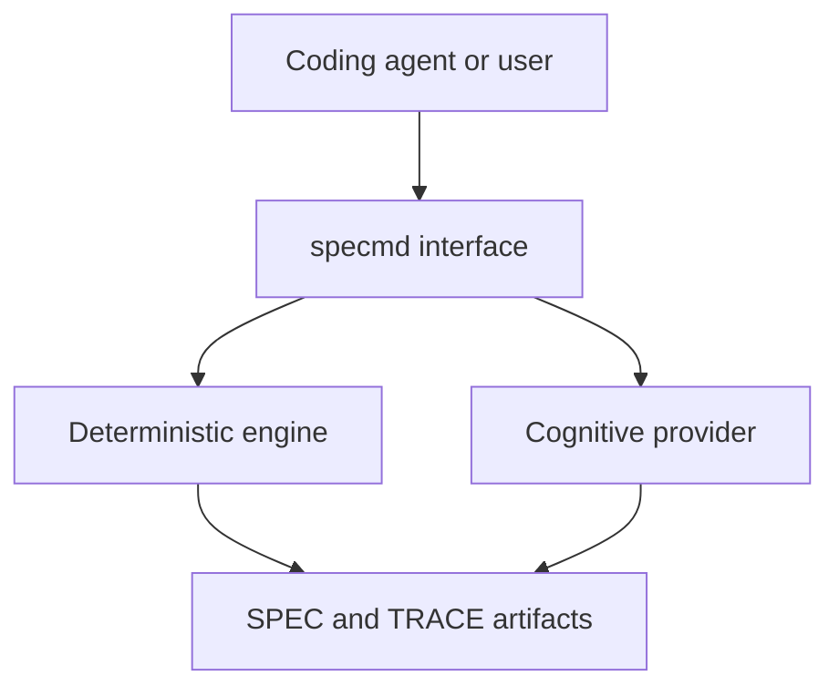

# specmd Coding-Agent and Cognitive Integration Contract

This document is a Normative Module of `SPEC.md` version `0.12.1`.

Uppercase **MUST**, **MUST NOT**, **SHOULD**, **SHOULD NOT**, and **MAY** use BCP 14 semantics. The Root Specification controls interpretation and precedence.

## 1. Scope

This module defines how `specmd` integrates with coding agents, LLM or cognitive providers, IDEs, automation, and continuous-integration systems.

The integration design enables AI-native semantic reasoning without making SPEC.md dependent on one model, agent, vendor, IDE, or hosted service.

## 2. Definitions

**Deterministic Engine** — the part of `specmd` that produces reproducible parsing, structural, reference, version, trace, and policy results.

**Cognitive Provider** — an LLM or equivalent reasoning service used for semantic drafting or analysis.

**Host-Agent Mode** — a coding agent invokes `specmd` and performs or supplies cognitive reasoning through the integration contract.

**Direct-Provider Mode** — `specmd` invokes a configured Cognitive Provider directly.

**Deterministic-Only Mode** — operations run without a Cognitive Provider and report the resulting semantic limitations.

**Agent Adapter** — thin, target-specific instructions or configuration that connect a coding agent to the tool and identify the Root Specification as authoritative.

**Proposed Patch** — a reviewable suggested change that has not been applied to a human-maintained artifact.

**Reviewer Agent** — an additional configured coding agent or Cognitive Provider asked to perform an independent semantic review through a versioned connector.

**Reviewer Connector** — a thin adapter or broker that accepts prepared review context and returns a structured reviewer response.

## 3. Integration Model

The diagram is informative. Normative behavior is defined below.

## 4. Requirements

### 4.1 Tool-Neutral Access

- **INTG-001:** Every required `specmd` capability MUST be accessible through the CLI without requiring a particular coding agent or IDE.
- **INTG-002:** Agent-invoked operations MUST support the versioned JSON contracts defined by the CLI ICD.
- **INTG-003:** The tool MUST expose machine-readable capability discovery identifying tool version, supported Core and Optional versions, commands, cognitive modes, adapter targets, and interface versions.
- **INTG-004:** A coding agent MUST be able to supply an explicitly named Root Specification whose filename is not `SPEC.md`.
- **INTG-005:** Integration behavior MUST remain equivalent whether invoked by a human, coding agent, IDE, or CI system, except for explicitly interactive behavior.

### 4.2 Cognitive Modes

- **COG-001:** Semantic creation and analysis MUST support Host-Agent Mode or Direct-Provider Mode; an implementation MAY support both.
- **COG-002:** Structural validation MUST support Deterministic-Only Mode.
- **COG-003:** Deterministic-Only Mode MUST identify that semantic ambiguity, contradiction, completeness, and portability analysis was not fully performed.
- **COG-004:** Findings produced with Cognitive Provider participation MUST be labeled `heuristic` and MUST identify the provider mode used.
- **COG-005:** A Combined Result MUST keep deterministic findings distinguishable from cognitive findings.
- **COG-006:** Cognitive analysis MUST NOT silently resolve material ambiguity, invent product behavior, or convert assumptions into requirements.
- **COG-007:** Cognitive analysis MAY propose language, requirements, acceptance criteria, relationships, or patches, but proposed content MUST remain distinguishable from accepted normative content until explicitly applied.
- **COG-008:** The tool MUST NOT represent proposed, inferred, or planned information as existing implementation or verification evidence.
- **COG-009:** When cognitive analysis is required but unavailable, the operation MUST return `indeterminate` for the affected semantic result while preserving any completed deterministic results.

### 4.3 Coding-Agent Capabilities

- **AGENT-001:** A coding-agent integration MUST support invoking creation, validation, inspection, black-box contract analysis, trace creation, trace update, Trace Pair validation, and adapter generation.
- **AGENT-002:** A coding agent MUST be able to request a Proposed Patch without granting permission to apply it.
- **AGENT-003:** Applying a Proposed Patch to a Root Specification, Normative Module, or Trace Document MUST require an explicit apply operation or prior user authorization covering that write.
- **AGENT-004:** Before completing a behavior-changing implementation task, an adapter SHOULD instruct the agent to update the applicable Specification Set and, when enabled, TRACE.md in the same change.
- **AGENT-005:** Before completing such a task, an adapter SHOULD instruct the agent to validate the Specification Set and Trace Pair.
- **AGENT-006:** Agent-specific prompts, rules, or configuration MUST NOT become hidden sources of normative product behavior.
- **AGENT-007:** When an Agent Adapter conflicts with the Root Specification, the Root Specification MUST remain authoritative.
- **AGENT-008:** The initial adapter targets MUST include `codex`, `claude-code`, `cursor`, and `github-copilot`.
- **AGENT-009:** Unsupported or unavailable target versions MUST be surfaced; the tool MUST NOT silently generate a different target's adapter.
- **AGENT-010:** When the optional Cucumber connector is advertised, a coding-agent integration MAY create and maintain project-specific step definitions, but `specmd` itself MUST NOT absorb that implementation-heavy responsibility.
- **AGENT-011:** A coding-agent or structured-tool adapter MUST NOT invoke `specmd cucumber run` without authorization that explicitly covers executing the selected project test integration.
- **AGENT-012:** A coding-agent integration MUST preserve the Root Specification's declared standards versions and MUST NOT substitute a repository's latest release; it MAY select an exact repository release or explicit local standards copy through the CLI ICD.

### 4.4 Agent Adapter Contract

Every generated Agent Adapter MUST:

- identify the Root Specification path;
- identify how to invoke `specmd` in machine-readable mode;
- require the agent to read the Root Specification and Normative Modules before changing specified behavior;
- preserve the distinction between implementation freedom, material ambiguity, and normative conflict;
- instruct the agent not to use human-only comments as implementation input;
- state that SPEC.md is authoritative for required behavior;
- identify the Trace Document when trace is enabled;
- avoid duplicating normative requirements; and
- identify the adapter format version and target.

- **ADPI-001:** Adapter generation and adapter installation MUST remain separate operations.
- **ADPI-002:** Installation MUST require explicit authorization and MUST report every target path it creates or changes.
- **ADPI-003:** Updating an adapter MUST preserve unrelated human-maintained content or surface a conflict rather than overwrite it silently.
- **ADPI-004:** A generated adapter SHOULD use the target's native instruction mechanism when available.

### 4.5 MCP and Structured Tool Integration

- **MCP-001:** The implementation SHOULD expose an MCP server or an equivalent structured tool interface.
- **MCP-002:** A structured tool interface SHOULD expose operations equivalent to `create`, `validate`, `inspect`, `blackbox`, `trace_create`, `trace_update`, `validate_pair`, `propose_patch`, and `capabilities`; it MAY expose separately authorized Cucumber connector operations when that capability is installed.
- **MCP-003:** Structured tool inputs and outputs MUST preserve the same semantics as their CLI and JSON equivalents.
- **MCP-004:** Structured write tools MUST distinguish proposal from application and MUST not broaden authorization received from the caller.
- **MCP-005:** Interface discovery MUST identify which operations are read-only and which may write files.

### 4.6 Cognitive Provider Contract

- **PROV-001:** Direct-Provider Mode MUST require explicit provider configuration.
- **PROV-002:** Credentials MUST be obtained from a secure runtime mechanism and MUST NOT be written into SPEC.md, TRACE.md, adapters, reports, logs, or command history by the tool.
- **PROV-003:** Before remote processing, the tool MUST identify which Specification Set content will be transmitted and the purpose of transmission.
- **PROV-004:** Human-only comments and explicitly redacted content MUST be removed before provider transmission.
- **PROV-005:** Provider requests SHOULD include the operation, relevant Specification Set context, applicable standard versions, and a structured response contract.
- **PROV-006:** Provider responses MUST be treated as untrusted input until parsed and validated.
- **PROV-007:** Cognitive result metadata MUST identify provider mode and SHOULD identify provider, model, and model version when available.
- **PROV-008:** The tool MUST support disabling remote cognitive processing for an operation.
- **PROV-009:** A provider failure MUST NOT erase, weaken, or reclassify completed deterministic findings.

### 4.7 Context Preparation

- **CTX-001:** Context supplied to a coding agent or Cognitive Provider MUST begin from the explicitly selected Root Specification.
- **CTX-002:** Every referenced Normative Module required for the operation MUST be included or identified as unavailable.
- **CTX-003:** Human-only comments MUST be excluded.
- **CTX-004:** Context preparation MUST preserve normative meaning, identifiers, source boundaries, and precedence.
- **CTX-005:** If context limits require omission, the tool MUST report what was omitted and MUST NOT claim complete semantic analysis.
- **CTX-006:** Informative companion artifacts MUST be labeled as informative in prepared context.

### 4.8 CI and Automation

- **AUTO-001:** CI integrations MUST be non-interactive unless explicitly configured otherwise.
- **AUTO-002:** CI integrations MUST use documented exit statuses and versioned machine-readable output.
- **AUTO-003:** CI validation MUST support custom Root Specification and Trace Document paths.
- **AUTO-004:** CI MUST be able to require deterministic validation without configuring a Cognitive Provider.
- **AUTO-005:** If a policy requires cognitive validation, absence or failure of the configured cognitive mode MUST fail that policy without discarding deterministic results.
- **AUTO-006:** Automation MUST NOT apply Proposed Patches unless explicitly authorized by configuration under the user's control.

### 4.9 Compatibility

- **ICOMP-001:** Integration and adapter formats MUST be versioned independently from the project `spec_version`.
- **ICOMP-002:** Adding support for a new coding agent MUST NOT change the meaning of existing adapter targets.
- **ICOMP-003:** A breaking integration-contract change MUST use a new major interface-format version.
- **ICOMP-004:** Capability discovery MUST allow callers to reject unsupported interface versions before invoking an operation.

### 4.10 Additional Reviewer Agents

- **MREV-001:** Additional Reviewer Agents MUST be optional; an invocation that does not select one MUST retain the ordinary single-mode behavior.
- **MREV-002:** The CLI MUST permit one or more configured Reviewer Agents to be selected for supported review operations.
- **MREV-003:** `specmd` MUST remain a lightweight coordinator: semantic review MUST be performed by the selected agents, while the tool limits its role to context preparation, dispatch, response validation, aggregation, and reporting.
- **MREV-004:** Each Reviewer Agent MUST receive the same authoritative Root Specification, applicable Normative Modules, standard versions, operation objective, and structured response contract, subject only to disclosed connector limits.
- **MREV-005:** Reviews SHOULD be independent; the tool MUST NOT expose one reviewer's conclusions to another unless an explicitly selected review workflow declares that behavior.
- **MREV-006:** Every reviewer finding MUST retain the originating reviewer identity and available provider/model metadata.
- **MREV-007:** Aggregation MAY group substantially equivalent findings, but MUST preserve every contributing reviewer and MUST surface material disagreement.
- **MREV-008:** Reviewer agreement or majority MUST NOT convert heuristic output into deterministic evidence or establish conformance by itself.
- **MREV-009:** Unavailable, invalid, incomplete, or timed-out reviewers MUST be handled according to the selected review policy without erasing completed deterministic or reviewer results.
- **MREV-010:** Selecting a remote Reviewer Agent MUST follow the credential, disclosure, filtering, and disablement requirements of the Cognitive Provider Contract; selection MUST NOT imply silent authorization to transmit content.
- **MREV-011:** Capability discovery MUST report available Reviewer Agent targets, connector versions, locality when known, and supported operations without exposing credentials.
- **MREV-012:** Reviewer Agents MAY return Proposed Patches, but multi-review selection MUST NOT authorize applying any patch or modifying a human-maintained artifact.

## 5. Supported and Prohibited Operations

Supported through integrations:

- read and prepare specification context;
- create a draft Root Specification;
- validate and inspect a Specification Set;
- analyze its externally observable Black-Box Contract;
- create, update, and validate traceability;
- generate Proposed Patches;
- explicitly apply authorized patches;
- generate and explicitly install Agent Adapters;
- return machine-readable results; and
- invoke an advertised Cucumber connector only through its separate command or structured-tool family.

Prohibited without explicit authorization:

- replacing human-maintained normative content;
- installing or activating adapter files;
- transmitting specification content to a remote provider;
- executing implementation code or test suites; and
- treating cognitive output as deterministic evidence.

## 6. Verification and Acceptance

- **IACC-001 — INTG-001/002/004/005:** Given the same custom-named Root Specification, when a human and a coding agent invoke JSON validation, then semantically equivalent results are returned.
- **IACC-002 — COG-002/003/004/005:** Given cognitive processing is disabled, when inspection runs, then deterministic results remain available and missing semantic analysis is explicit.
- **IACC-003 — COG-006/007/008:** Given a provider proposes new behavior and inferred trace links, when results are returned, then they are labeled as proposals or inferences and neither becomes accepted behavior or executed evidence.
- **IACC-004 — AGENT-002/003, MCP-004:** Given an agent requests a Proposed Patch without write authorization, when the operation completes, then source files remain unchanged.
- **IACC-005 — AGENT-006/007, ADPI-001/002:** Given an adapter is generated, when inspected before installation, then it contains no duplicated product requirements, identifies SPEC.md as authoritative, and has changed no target file.
- **IACC-006 — PROV-002/003/004/008:** Given remote cognition is enabled, when content is prepared, then credentials, human-only comments, and redacted content are absent and the user-visible transmission scope is identified.
- **IACC-007 — CTX-001/002/005:** Given a required Normative Module cannot fit or be loaded, when cognitive analysis runs, then the omission is reported and the result does not claim complete semantic analysis.
- **IACC-008 — AUTO-001/002/003/004:** Given CI has no Cognitive Provider, when deterministic validation runs against explicit custom paths, then it completes non-interactively with documented JSON and exit status.
- **IACC-009 — ICOMP-001/003/004:** Given a caller supports an older integration format, when capability discovery reports an incompatible major version, then the caller can reject invocation before submitting content.
- **IACC-010 — MREV-001/002/003:** Given two configured Reviewer Agents, when both are selected for inspection, then the tool coordinates both reviews without performing their semantic reasoning and ordinary behavior remains unchanged when neither is selected.
- **IACC-011 — MREV-004/005/006/007/008:** Given independent reviewers return overlapping and conflicting findings, when results are aggregated, then authoritative context is equivalent, origins are preserved, overlap is grouped without lost attribution, disagreement is visible, and every reviewer finding remains heuristic.
- **IACC-012 — MREV-009/010/011:** Given one requested remote reviewer is unavailable, when review runs under each policy, then transmission controls are honored, capability metadata identifies the target, completed results are preserved, and the policy determines whether the operation fails.
- **IACC-013 — MREV-012, AGENT-002, AGENT-003:** Given multiple reviewers propose patches, when review completes without apply authorization, then all source artifacts remain unchanged.
- **IACC-014 — AGENT-010/011, AUTO-006:** Given an agent can access an advertised Cucumber connector, when it generates step-definition proposals or invokes ordinary `specmd` analysis without explicit execution authorization, then project code is not executed and no proposed implementation is applied.
- **IACC-015 — AGENT-012, CTX-001/002:** Given a Root Specification declares an earlier Core version while a newer repository release exists, when a coding agent validates it, then the declared version is preserved and the exact selected repository or local source is reported.

## 7. Notes

Direct integration with every agent is not required for core correctness. The universal CLI and JSON contracts provide the baseline; adapters, Reviewer Connectors, and structured tool interfaces improve native usability.

Coding-agent and Cognitive Provider products evolve independently. This module therefore specifies capabilities and version negotiation rather than hard-coding product releases.
